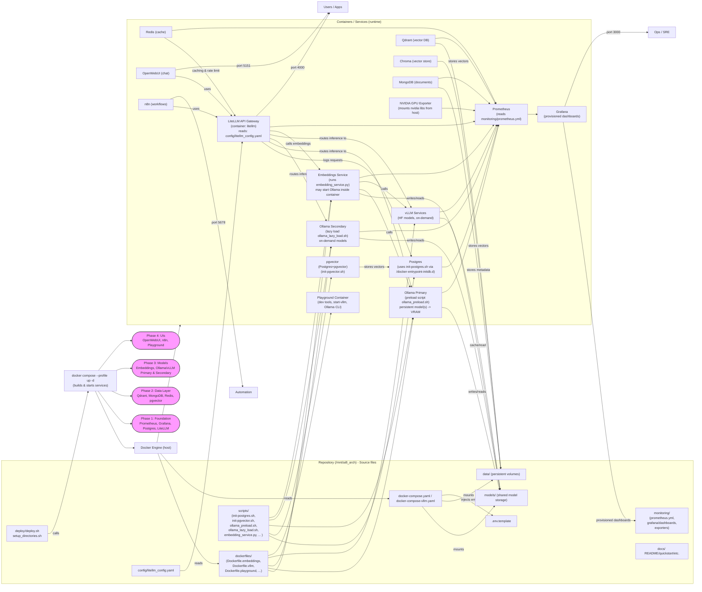

```markdown
--- 
marp: true
theme: default
class: lead
paginate: false
---

# AI8 Deployment — Config & Scripts Interaction
Single slide: deployment config / dockerfiles / scripts interaction diagram

---

## Deployment flow (visual)


---

## Deployment sequence (concise)
1. deploy.sh (or docker compose) reads `.env.template` and `docker-compose*.yaml`, then instructs Docker to build images from `dockerfiles/` and start containers with mounted volumes (`/mnt/ai8_arch/models`, `/mnt/ai8_arch/data`, `/mnt/ai8_arch/logs`).
2. DB init: Postgres runs `init-postgres.sh` (mounted in `/docker-entrypoint-initdb.d`) → schemas, extensions, initial DBs created. `pgvector` runs `init-pgvector.sh`.
3. LiteLLM reads `config/litellm_config.yaml` to register model aliases and routing; logs to Postgres.
4. Model services:
   - Ollama primary runs `ollama_preload.sh` to pull & preload persistent models into VRAM.
   - Ollama secondary runs `ollama_lazy_load.sh` (on‑demand load, auto‑unload).
   - vLLM services serve HF models (via docker‑compose‑vllm.yaml).
   - All use `models/` volume for persistence.
5. Embeddings service (`embedding_service.py`) interfaces with Ollama or HuggingFace models to produce embeddings, caches HF models under the shared cache.
6. Prometheus scrapes exporters and services; Grafana reads Prometheus and auto‑provisions dashboards (monitoring/grafana/*).
7. UIs (OpenWebUI, n8n, Playground) call LiteLLM (port 4000) and embedding service (port 8010) for RAG workflows.

---

## Text snippet (from thread)
I created a mermaid diagram and concise sequence showing how each class of file participates in the deployment lifecycle and where to find the key pieces in the repo. If you want, I can (a) export this diagram to PNG/SVG, (b) embed it into a single-slide PPTX, or (c) expand the diagram into a sequence diagram showing the runtime call order for a sample RAG request — tell me which option you prefer and I will generate it next.

---

## Convert to PPTX (one-line)
Install Marp CLI (if needed) and export:

1) Install:
- npm: npm install -g @marp-team/marp-cli
- or use npx without global install

2) Convert:
```bash
npx @marp-team/marp-cli AI8_deployment_single_slide.md --pptx -o ai8_deployment_slide.pptx
```

Notes:
- Marp will render the Mermaid diagram into the slide. If you prefer a PNG or SVG instead:
```bash
npx @marp-team/marp-cli AI8_deployment_single_slide.md -o ai8_deployment_slide.png
```

---
```