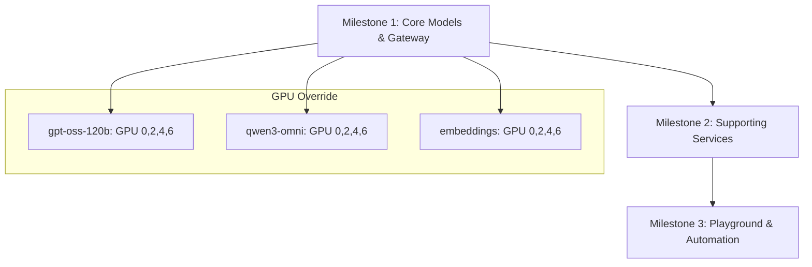

# AI8 Architecture Roadmap

## Overview

This roadmap details the phased deployment, configuration, and validation of the AI8 architecture, with a strict override for GPU allocation: **all core models (gpt-oss-120b, qwen3-omni, embeddings) must be evenly distributed across GPU IDs 0, 2, 4, and 6**. Each milestone is independently deployable and verifiable, with robust Python-based testing at every stage.

---

## GPU Allocation Override (Non-Negotiable)

- **All core models** (`gpt-oss-120b`, `qwen3-omni`, `embeddings`) must be configured for an even distribution across GPU IDs **1, 3, 5, 7**.
- This overrides any default or project-documented GPU mapping.
- All configuration files, Docker Compose, and runtime scripts must reflect this allocation.
- **No deployment or test is valid unless this override is enforced.**

---

## Milestone Structure

### **Milestone 1: Core Models & Gateway**

**Objective:** Deploy and validate the three core models and the LiteLLM gateway, enforcing the GPU override.

- Deploy `gpt-oss-120b`, `qwen3-omni`, and all embeddings models, each distributed across GPUs 1, 3, 5, 7.
- Validate each model’s API responsiveness independently.
- Deploy and configure the LiteLLM gateway to unify model access.
- Validate unified API routing and fallback logic.

### **Milestone 2: Supporting Services**

**Objective:** Deploy and validate all supporting infrastructure.

- Deploy OpenWebUI (chat interface).
- Deploy monitoring stack: Prometheus, Grafana, GPU Exporter.
- Deploy all required databases: PostgreSQL, Qdrant, MongoDB, Redis.
- Validate service health, metrics collection, and database connectivity.

### **Milestone 3: Playground & Automation**

**Objective:** Deploy and validate user-facing experimentation and automation.

- Deploy the model-free Playground service.
- Deploy the n8n automation service.
- Validate model pulling from both Ollama and HuggingFace Hub within the Playground.
- Validate workflow automation and integration with core models and databases.

---

## Testing Plan

All test scripts must be placed in `ai8_arch/` and be robust, interactive Python scripts (unless otherwise specified). Each script should log results and exit nonzero on failure.

### **Milestone 1: Core Models & Gateway**

- `test_gpt_oss_api.py`: Validate gpt-oss-120b API (read/write, streaming, error handling).
- `test_qwen3_omni_api.py`: Validate qwen3-omni API (same as above).
- `test_embeddings.py`: Validate all embedding models (single/batch, dimension checks).
- `test_litellm.py`: Validate unified API routing, fallback, and error codes.
- `test_gpu_allocation.py`: Assert all core models are running on GPUs 1, 3, 5, 7 (parse `nvidia-smi` and container logs).
- `test_cross_model_call.py`: Simulate LLM calling the embeddings service via API.

### **Milestone 2: Supporting Services**

- `test_services.py`: Validate OpenWebUI, Prometheus, Grafana, and GPU Exporter endpoints.
- `test_vector_dbs.py`: Validate Qdrant (collection creation, vector insert/search, metadata filtering).
- `test_postgres.py`: Validate PostgreSQL (connectivity, schema, read/write).
- `test_mongodb.py`: Validate MongoDB (document insert/query/aggregation).
- `test_redis.py`: Validate Redis (set/get, TTL, pub/sub).
- `test_monitoring_metrics.py`: Validate Prometheus and Grafana dashboards for all core metrics.

### **Milestone 3: Playground & Automation**

- `test_playground_model_pull.py`: Validate model pull from Ollama and HuggingFace Hub in Playground.
- `test_playground_query.py`: Validate Playground can query all core models and embeddings.
- `test_n8n_workflow.py`: Validate n8n can trigger LLM and embedding calls, and write to databases.
- `test_rag_pipeline.py`: End-to-end RAG: prompt → embedding → vector DB → retrieval → LLM completion.

---

## Expanded Test Coverage

To ensure architectural robustness, add the following:

- **GPU Stress/Failover Test:** Simulate GPU failure or removal and validate model reallocation or error reporting.
- **Concurrent Load Test:** Simulate 10+ concurrent users across all APIs, measure latency and error rates.
- **Database Failover Test:** Temporarily stop a database container and validate system error handling and recovery.
- **Security Test:** Attempt unauthorized API access and validate authentication/authorization enforcement.
- **Data Consistency Test:** Insert/update data via one API, verify consistency across all relevant services.
- **Monitoring Alert Test:** Artificially trigger metric thresholds (e.g., high VRAM, high error rate) and validate alerting in Grafana.

---

## Architectural Priorities

- **Stepwise, Verifiable Deployment:** Each milestone must be independently deployable and testable before proceeding.
- **Configuration-First:** All configuration (especially GPU allocation) must be explicit and version-controlled.
- **Observability:** All services must expose health and metrics endpoints; dashboards must be pre-provisioned.
- **No Premature Optimization:** Focus on correctness, modularity, and testability before tuning for performance.

---

## Mermaid Diagram: Milestone Flow

---

## Implementation Notes

- All test scripts must be idempotent and log results to `ai8_arch/logs/`.
- Each milestone must include a checklist for manual verification.
- All configuration changes (especially GPU allocation) must be reviewed before deployment.
- Any deviation from the GPU override must be treated as a critical error.

---

## Review & Feedback

Please review this roadmap for completeness and alignment with your requirements. Indicate any changes or additions before implementation.
